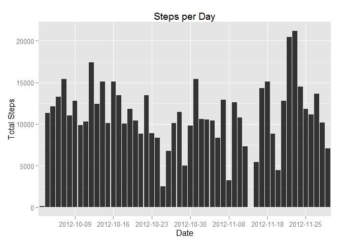
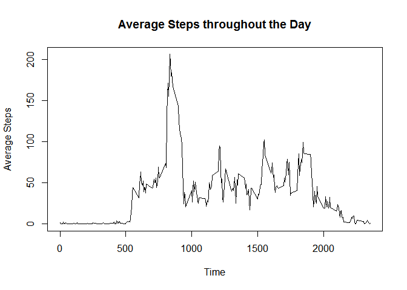
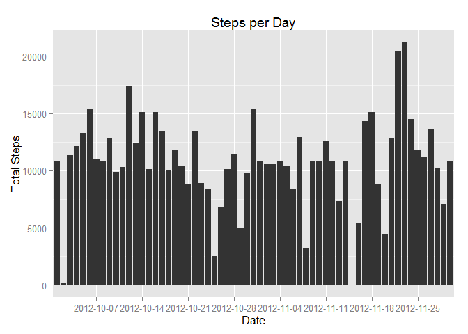

# Reproducible Research: Peer Assessment 1


## Loading and preprocessing the data
The data is assumed to be in a zip file in the same directory as this document. If it is not, download it. Unzip it and read it into a data frame.

```r
knitr::opts_chunk$set(fig.path='figure/')
options(scipen = 1, digits = 2)

# Check for the presence of the data, possibly zipped.
fileUrl <- "https://d396qusza40orc.cloudfront.net/repdata%2Fdata%2Factivity.zip"
zipfn <- "activity.zip"
csvfn <- "activity.csv"

# Make sure the data is available in the current directory.
if (!file.exists(csvfn)) {
    if (!file.exists(zipfn)) {
        # Download the data file
        download.file(fileUrl, zipfn, "curl")
    }
    # Unzip the data file
    unzip(zipfn)
}

data <- read.csv(csvfn)
```


## What is mean total number of steps taken per day?
Ignoring missing (NA) values, the number of steps taken per day is shown here:

```r
#cleanData <- subset(data, steps!="NA")
cleanData <- na.omit(data)
output1 <- aggregate(cleanData$steps, by = list(Date=cleanData$date), FUN=sum, simplify = TRUE)

library(ggplot2)
ticks <- c("2012-10-09","2012-10-16","2012-10-23","2012-10-30","2012-11-08","2012-11-18","2012-11-25")
ggplot(output1, aes(Date, x)) +
    geom_bar(stat="identity") +
    labs(title="Steps per Day") +
    ylab("Total Steps") +
    scale_x_discrete(breaks=ticks)
```

 

```r
avgSteps <- mean(output1$x)
medSteps <- median(output1$x)
```
**The average number of steps per day is 10766.19.**  
The median number of steps per day is 10765.  


## What is the average daily activity pattern?
Throughout the day the average number of steps varies as in this plot:

```r
output2 <- aggregate(cleanData$steps, by = list(Time=cleanData$interval), FUN=mean, simplify = TRUE)

plot(output2$Time, output2$x, main="Average Steps throughout the Day", xlab="Time", ylab="Average Steps", type="l")
```

 

```r
maxInterval <- output2[which.max(output2$x),"Time"]
```
**The time interval with the greatest number of steps (on average over all days) is 835.**  


## Imputing missing values

```r
miss <- sum(is.na(data$steps))
```
The number of missing values in the data set is 2304.  
We will fill the missing values by using the average value for that time of day from the rest of the data set.  


```r
imputed <- data
imputed$steps[is.na(imputed$steps)] <- round(output2$x)

output3 <- aggregate(imputed$steps, by = list(Date=imputed$date), FUN=sum, simplify = TRUE)
ticks3 <- c("2012-10-07","2012-10-14","2012-10-21","2012-10-28","2012-11-04","2012-11-11","2012-11-18","2012-11-25")
ggplot(output3, aes(Date, x)) +
    geom_bar(stat="identity") +
    labs(title="Steps per Day") +
    ylab("Total Steps") +
    scale_x_discrete(breaks=ticks3)
```

 

```r
avgSteps3 <- mean(output3$x)
medSteps3 <- median(output3$x)
```
**The average number of steps per day is 10765.64.**  
The median number of steps per day is 10762.  

These values are slightly, but not significantly, lower than those calculated by skipping the missing data, so this method of imputing missing data seems like a good choice.

## Are there differences in activity patterns between weekdays and weekends?
In the following graph, we separate the steps by whether they occur on a weekday or a weekend.


```r
# Turn the date into a weekday/weekend factor
imputed$day <- as.factor(weekdays(as.Date(imputed$date),TRUE))
imputed$wkend <- as.factor(ifelse(grepl('^S', imputed$day),"weekend", "weekday"))

output4 <- aggregate(imputed$steps, by = list(Time=imputed$interval,Weekend=imputed$wkend), FUN=mean, simplify = TRUE)

library(lattice)
xyplot(x~Time|Weekend, data=output4, layout=c(1,2), type="l", ylab="Number of steps", xlab="Interval")
```

 

We can see that there are a number of differences:  

* The peak is around 8 AM on weekdays.
* Activity starts earlier on weekdays.
* Activity ends later on weekends.
* Activity is generally higher througout the day on weekends.


